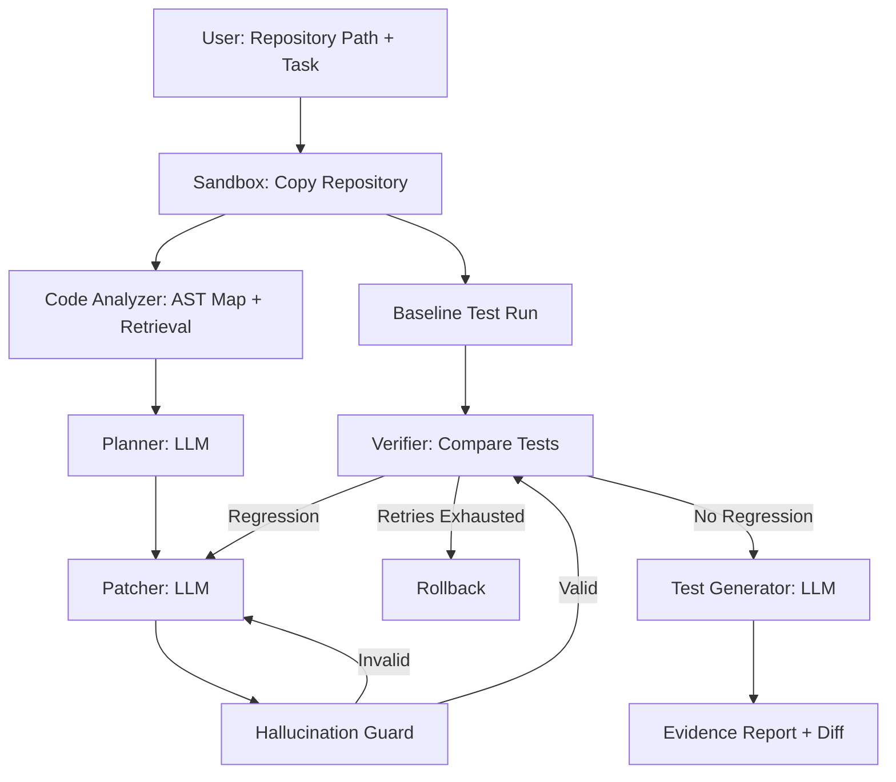

# NEXORA-8: AI Software Engineering Agent

An AI software engineering agent that reads an existing Python codebase, fixes bugs or adds small features, and verifies that the changes do not introduce regressions by comparing test results before and after the modification.

Built for **HackNex 2026 (Internal Qualifier)** under **Problem Statement HNX26PSI09: AI Software Engineering Agent**, Division of Computer Science and Engineering, Karunya Institute of Technology and Sciences.


## 1. Problem Statement

Real-world software repositories consist of thousands of lines of code distributed across backend and frontend modules, databases, APIs, tests, configuration files, and documentation. Making changes safely requires developers to understand the existing codebase, identify the correct files and functions, implement the requested modification, and verify that previously working functionality has not been affected.

Most AI-based coding tools focus on generating code or modifying existing code but do not provide sufficient evidence that the changes preserve existing functionality. AI-generated changes may introduce incorrect imports, undefined functions, invalid code, or unintended behavioural changes.

The problem is to develop an AI Software Engineering Agent that can understand an existing Python codebase, identify the relevant components, implement a requested bug fix or small feature, and verify the modification through automated testing without introducing regressions or hallucinated APIs.

---

## 2. Project Overview

NEXORA-8 is a command-line AI Software Engineering Agent designed to safely modify existing Python repositories.

The system accepts two primary inputs:

- A Python repository containing a pytest test suite
- A task description specifying a bug fix or feature request

The agent produces:

- A patched copy of the repository
- A before-and-after test comparison
- New tests covering the implemented change
- An evidence report containing the root cause, modified files, test results, retries, and generated diff

The original repository is never directly modified. All changes are performed inside an isolated sandbox environment.

---

## 3. Objectives

- Automatically understand an unseen Python codebase, including files, functions, classes, imports, and tests.
- Identify the appropriate files and functions for a requested modification.
- Perform small, targeted, and minimal code changes.
- Verify that all previously passing tests continue to pass after modification.
- Detect and block hallucinated imports, functions, and undefined names.
- Generate meaningful tests for newly implemented changes.
- Provide an evidence-based explanation of the identified problem and implemented solution.
- Safely roll back changes when the modification cannot be verified.

---

## 4. Proposed Solution

NEXORA-8 treats the Large Language Model as an untrusted component and places deterministic verification mechanisms around it.

The core principle is:

> **The LLM proposes; deterministic verification components approve.**

The system operates through the following stages:

1. A baseline test run records the exact state of the repository before modification.
2. A code analyzer creates a structural map of the repository and identifies files relevant to the requested task.
3. The LLM generates a plan containing the suspected root cause and target files.
4. The LLM generates small search-and-replace patches instead of rewriting entire files.
5. A hallucination guard validates syntax, undefined names, and import resolution.
6. The verifier executes the test suite and compares the results against the baseline.
7. If a regression is detected, the failure information is provided to the LLM for another attempt.
8. If the maximum retry limit is reached without successful verification, the system rolls back the changes.
9. New tests are generated and verified to fail before the fix and pass after the fix.
10. An evidence report containing the complete verification information is generated.

---

## 5. Key Features

| Feature | Description |
|---|---|
| Sandboxed Execution | Performs modifications on a temporary copy without changing the original repository. |
| Baseline Snapshot | Records the pass/fail state of the complete test suite before modification. |
| Code Mapping and Retrieval | Uses Python AST analysis to identify relevant files, classes, functions, and imports. |
| Minimal Patches | Uses targeted search-and-replace edits to keep changes small and reviewable. |
| Hallucination Guard | Detects invalid syntax, undefined names, and unresolved imports. |
| Regression Detection | Identifies tests that passed before modification but fail after the change. |
| Automatic Rollback | Restores the repository to the previous valid state when verification fails. |
| Test Generation | Generates and validates tests for the implemented modification. |
| Evidence Report | Provides root-cause analysis, code changes, test comparisons, retries, and generated tests. |

---

## 6. System Architecture



---

## 7. Quick Start & Execution

### 1. Installation
```bash
git clone https://github.com/mashyasherin0809/NEXORA-8.git
cd NEXORA-8
pip install -r requirements.txt
```

### 2. Launch Agent Monitoring Web Dashboard & REST/SSE Server
```bash
python cli.py serve --port 5000
```
Open **http://localhost:5000** in your browser to access the complete interactive Agent Monitoring Dashboard, inspect live telemetry, analyze diffs, and view execution gates in real-time.

### 3. Run Autonomous Repair via CLI
```bash
# Basic run in sandbox with evidence report
python cli.py run --repo /path/to/target/repo --task "Fix negative total calculation in apply_discount"

# Run with Gemini / OpenAI / Anthropic or offline heuristic
python cli.py run --repo /path/to/target/repo --task "Fix calculation logic" --provider gemini --model gemini-2.5-flash

# Automatically apply verified changes to original repo on 0 regressions
python cli.py run --repo /path/to/target/repo --task "Fix pricing bug" --apply --output-report report.md
```

### 4. Run Streamlit Interactive UI
```bash
streamlit run ui.py
```

### 5. Run Test Suite
```bash
pytest -v
```

## 8. RepoPilot Console

RepoPilot is the current FastAPI + React product surface for the same verified-agent engine.

```bash
# Terminal 1: API and SSE server
uvicorn nexora.server.fastapi_app:app --reload --port 8000

# Terminal 2: React/Vite console
cd frontend
npm install
npm run dev
```

Open `http://localhost:5173`. The console accepts a local repository path or Git URL and streams each run through the intake, analysis, baseline, planning, patch, and verification stages. Run history is persisted in SQLite (`repopilot.db` by default), and isolated workspaces are created under the system temporary directory.

The adapter contract lives in `nexora/analyzer/language_adapter.py`. Maven/Java runs use `mvn -q test` and JUnit-oriented repository analysis; Python uses the existing AST indexer and autonomous repair orchestrator; Node/npm is defined as the extension point for Jest execution.

Configure `LLM_PROVIDER`, `LLM_API_KEY`, and `LLM_MODEL` for provider-backed repair planning. Without credentials, RepoPilot still performs repository intake, structural analysis, and deterministic baseline evidence before reporting that patch synthesis needs configuration.
